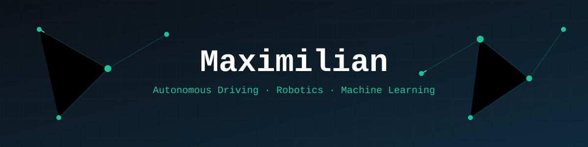
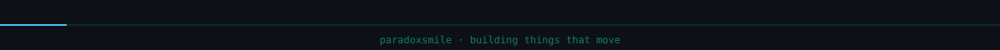

### 👋 About me
- 🎓 Dual Student **B.Sc. Data Science & AI** @ DHBW Ravensburg (Focus: AI & Intelligence Engineering)
- 🏎️ Autonomous Driving Team @ **Global Formula Racing**: Driverless stack in ROS (C++/Python)
- 🚗 Practical phases at a Mercedes-Benz Tech Innovation
- 🚀 Long-term: Getting into deep-tech 

### 🔭 Currently building
- **Showcase projects** in robotics & ML · stay tuned

### 🛠️ Tech Stack

  

### 📊 GitHub Stats
 

### 📫 Connect

